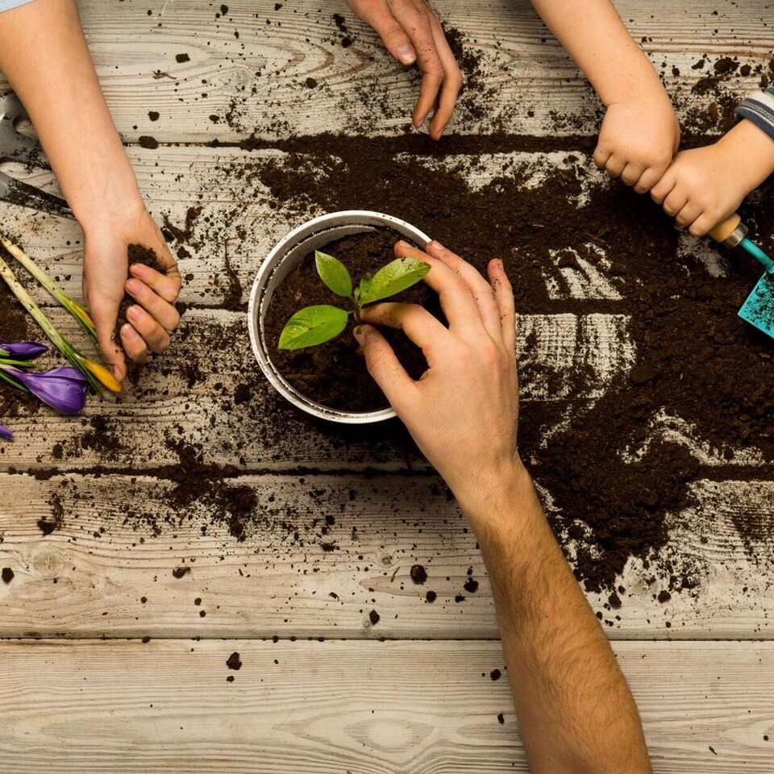

# Actividades-sostenibles

### Índice

1. [Introducción a la sostenibilidad en los sistemas productivos.]()
2. [El modelo actual de producción y consumo.]()
3. [Economía verde y economía circular.]()
4. [Evaluación de impactos ambientales.]()
5. [Ecodiseño aplicado al sistema productivo.]()
6. [Estrategias sostenibles en actividades productivas.]()
7. [Análisis del ciclo de vida del producto.]()
8. [Procesos de producción sostenibles.]()
9. [Marco normativo ambiental.]()
10. [Conclusiones.]()
11. [Mapa conceptual.]()
12. [Glosario.]()
13. [Referencias.]()
14. [Autores.]()
